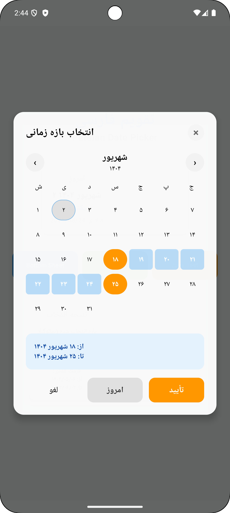
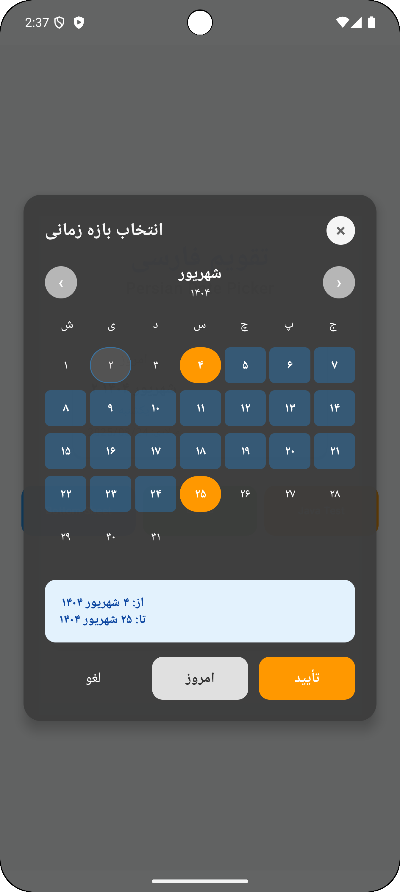
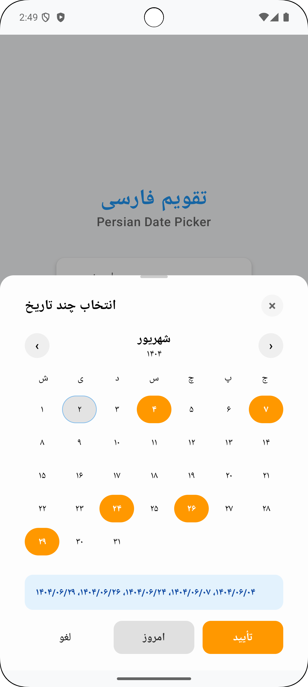
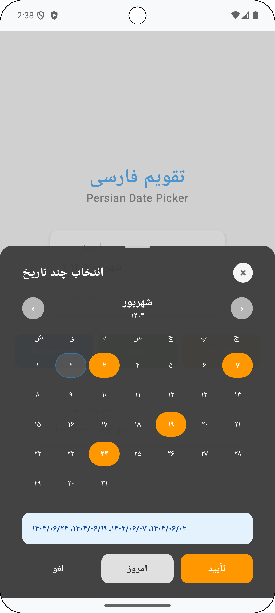

# Android Persian (Jalali) DatePicker for Jetpack Compose

[](https://jitpack.io/#Miaadrajabi/persianDatePicker) [](https://developer.android.com) [](https://kotlinlang.org) [](https://developer.android.com/jetpack/compose) [](LICENSE)

Clean, configurable Persian (Jalali/Iranian) Date Picker for Android with Jetpack Compose. Supports Single, Multiple, and Range selection in Dialog and Bottom Sheet, RTL-friendly, with full styling and an optional Year Picker.

Keywords: Android Persian DatePicker, Jalali Calendar, Jetpack Compose Date Picker, Range Picker, Multi-date, BottomSheet, Dialog.

## Features
- Single, Multiple, and Range selection modes
- Dialog or Bottom Sheet presentation with gravity control (Top, Center, Bottom)
- Full styling via `PersianDatePickerStyle` (colors, sizes, typography, ripple, footer)
- Builder-based config (size/sizeFraction, margins, paddings, dismiss behavior)
- Today button with custom text/callback and calendar auto-navigation
- Optional Year Picker (columns, range years, colors, corner radius)
- Selection summary footer and RTL-aware typography

## Installation (JitPack)

Add JitPack to repositories.

Kotlin DSL:
```kotlin
repositories {
    google()
    mavenCentral()
    maven(url = "https://jitpack.io")
}

dependencies {
    implementation("com.github.Miaadrajabi:persianDatePicker:v1.0.0")
}
```

Groovy DSL:
```groovy
repositories {
    google()
    mavenCentral()
    maven { url 'https://jitpack.io' }
}

dependencies {
    implementation 'com.github.Miaadrajabi:persianDatePicker:v1.0.0'
}
```

Version Catalog (optional):
```toml
[libraries]
persian-datepicker = { module = "com.github.Miaadrajabi:persianDatePicker", version = "v1.0.0" }
```
```kotlin
dependencies { implementation(libs.persian.datepicker) }
```

## Quick Usage
Minimal example with Dialog + Range:
```kotlin
var show by remember { mutableStateOf(false) }

Button(onClick = { show = true }) { Text("Pick Date Range") }

PersianDatePicker(
    isVisible = show,
    config = PersianDatePickerBuilder()
        .selectionMode(SelectionMode.RANGE)
        .presentation(PresentationStyle.DIALOG)
        .gravity(DialogGravity.CENTER)
        .sizeFraction(widthFraction = 0.95f, heightFraction = null)
        .dialogMargin(horizontal = 16.dp, vertical = 16.dp)
        .contentPadding(horizontal = 24.dp, vertical = 24.dp)
        .style(PersianDatePickerStyle())
        .showTodayButton(true)
        .todayButtonText("امروز")
        .singleTitle("انتخاب تاریخ")
        .multipleTitle("انتخاب چند تاریخ")
        .rangeTitle("انتخاب بازه تاریخ")
        .enableYearPicker(true)
        .showSelectionSummaryFooter(true)
        .build(),
    onDismiss = { show = false },
    onResult = { result ->
        when (result) {
            is SelectionResult.Single -> { /* result.date */ }
            is SelectionResult.Multiple -> { /* result.dates */ }
            is SelectionResult.Range -> { /* result.range */ }
        }
    }
)
```

Bottom Sheet + Multiple example (from sample app):
```kotlin
PersianDatePicker(
    isVisible = show,
    config = PersianDatePickerBuilder()
        .selectionMode(SelectionMode.MULTIPLE)
        .presentation(PresentationStyle.BOTTOM_SHEET)
        .style(PersianDatePickerStyle())
        .build(),
    onDismiss = { show = false },
    onResult = { /* handle SelectionResult.Multiple */ }
)
```

## Screenshots
<table>
  <tr>
    <td align="center">
      
      <br/>Range (Dialog) - Light
    </td>
    <td align="center">
      
      <br/>Range (Dialog) - Dark
    </td>
  </tr>
  <tr>
    <td align="center">
      
      <br/>Multiple (BottomSheet) - Light
    </td>
    <td align="center">
      
      <br/>Multiple (BottomSheet) - Dark
    </td>
  </tr>
</table>

## FAQ
- How do I set initial values?
  - Range: `.initialRange(PersianDateRange(start, end))`
  - Multiple: `.initialSelectedDates(setOf(date1, date2))`
- How do I enable the Year Picker?
  - `.enableYearPicker(true)` and customize via `PersianDatePickerStyle` (columns, colors, radius).
- What is the minimum SDK?
  - minSdk 24.

## Leap Year (سال کبیسه)
Handled internally for Jalali. You can also query:
```kotlin
val isLeap = PersianDate.isLeapYear(1404)
```

## License
MIT
